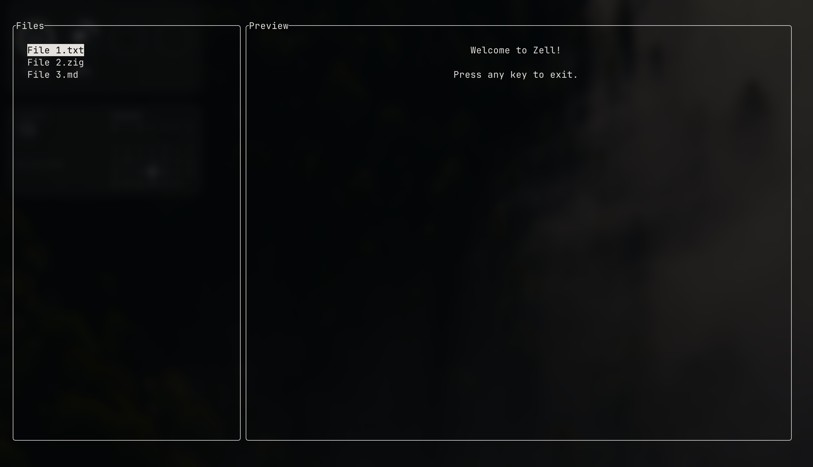

# Zell

Zell is a dependency-free minimalistic library for building TUIs on posix systems.

Zell uses zig `0.16.0-dev.2535+b5bd49460`

> [!WARNING]
> Zell is currently in development phase

# Getting started



## Add Zell to your project
Fetch Zell
```bash
zig fetch --save git+https://github.com/arthurcornil/zell.git
```

Add this to `build.zig` file
```zig
const zell = b.dependency("zell", .{
    .target = target,
    .optimize = optimize,
});
exe.root_module.addImport("zell", zell.module("zell"));
```

## Example
```zig
const std = @import("std");

const Zell = @import("zell");
const Pane = Zell.Pane;
const Col = Zell.Col;
const Layout = Zell.Layout;
const Terminal = Zell.Terminal;

// We define the terminal globally so our custom panic handler can 
// safely restore the terminal state (show cursor, exit alt screen) on a crash.
var terminal: Terminal = undefined;

pub const panic = std.debug.FullPanic(crashed);

fn crashed(msg: []const u8, trace: ?usize) noreturn {
    terminal.deinit();
    std.debug.defaultPanic(msg, trace);
}

pub fn main(init: std.process.Init) !void {
    // 1. Initialize Terminal (Raw mode, hide cursor, alt buffer)
    terminal = try Terminal.init(init.io);
    defer terminal.deinit();

    // 2. Create Panes
    // Pane A: A selectable list
    const arena = init.arena.allocator();
    var items: std.ArrayList([]const u8) = .empty;
    // defer items.deinit(arena);
    try items.append(arena, "File 1.txt");
    try items.append(arena, "File 2.zig");
    try items.append(arena, "File 3.md");

    const left_pane = Pane{
        .title = "Files",
        .height = 100, // 100% of the column height
        .content = Zell.Content{ .list = items },
        .options = .{ 
            .paddingHorizontal = 2, 
            .paddingVertical = 1,
            .selectableLine = true 
        },
    };

    // Pane B: Centered text content
    const right_pane = Pane{
        .title = "Preview",
        .height = 100,
        .content = Zell.Content{ .raw = "Welcome to Zell!\n\nPress any key to exit." },
        .options = .{ 
            .paddingHorizontal = 2, 
            .paddingVertical = 1, 
            .centerContent = true 
        },
    };

    // 3. Arrange Panes into Columns
    var left_col_panes = [_]Pane{ left_pane };
    var right_col_panes = [_]Pane{ right_pane };

    var cols = [_]Col{ 
        .{ .panes = &left_col_panes, .width = 30 },  // 30% of screen width
        .{ .panes = &right_col_panes, .width = 70 }, // 70% of screen width
    };

    // 4. Build and Render the Layout
    var layout = Layout{
        .cols = &cols,
        .options = .{ .paddingHorizontal = 2, .paddingVertical = 2 }
    };
    
    // Calculate sizing and draw to the screen
    try layout.positionPanes();
    try layout.render(init.io);
    
    // 5. Wait for input (Since we are in raw mode, this gets keystrokes instantly)
    // We block the thread until the user presses any key to quit.
    var buf: [1]u8 = undefined;
    _ = try std.posix.read(std.Io.File.stdin().handle, &buf);
}
```

# Usage

Import Zell
```zig
const Zell = @import("zell");
const Pane = Zell.Pane;
const Col = Zell.Col;
const Layout = Zell.Layout;
const Terminal = Zell.Terminal;
```

Init a `Terminal` instance. This will enable raw mode, hide the cursor and switch to an alternative buffer.
```zig
var terminal: Terminal = undefined;

pub fn main(init: std.process.Init) !void {
    terminal = try Terminal.init(init.io);
    defer terminal.deinit();
}
```

We define `terminal` globally to allow a custom panic handler to safely restore the terminal state (e.g., showing the cursor) if the application crashes at runtime. 
```zig
pub const panic = std.debug.FullPanic(crashed);

fn crashed(msg: []const u8, trace: ?usize) noreturn {
    terminal.deinit();
    std.debug.defaultPanic(msg, trace);
}

pub fn main(init: std.process.Init) !void { ...
```

Create a `Pane`
```zig
const pane1: Pane = .{
    .title = "Pane1 Title",
    .content = Zell.Content{ .raw = "pane1 content" },
    .height = 80,
    .options = .{ .paddingHorizontal = 2, .paddingVertical = 1, .centerContent = true },
};
```

> [!NOTE]
> `height` and `width` attributes represent percentages of the screen. `paddingVertical` and `paddingHorizontal` represent a number of cells.

Create your `Col`s. `Col`s consist of `Pane`s.
```zig
var leftPanes = [_]Pane { pane1 };
var cols = [_]Col{ .{ panes = &leftPanes, .width = 30 } };
```

Create your `Layout`, and render it.
```zig
var layout: Layout = .{
    .cols = &cols,
    .options = .{ .paddingHorizontal = 2, .paddingVertical = 2 }
};
try layout.positionPanes();
try layout.render(init.io);
```

> [!WARNING]
> The `Layout.positionPanes()` method is responsible for working out the position of the panes on the screen. Therefore, this method will have to be called each time the layout changes (e.g. making a pane taller or a col wider).

# Documentation

## Pane

```zig
pub const Content = union(enum){
    list: ArrayList([]const u8),
    raw: []const u8,
};

pub const PaneOptions = struct {
    boxed: bool = true,
    paddingVertical: u8 = 0,
    paddingHorizontal: u8 = 0,
    selectableLine: bool = false,
    centerContent: bool = false,
};

pub const Pane = struct {
    height: u8 = 100,
    title: []const u8 = "",
    options: PaneOptions = .{},
    content: ?Content = null,
    select: PaneList = .{},
};
```

`Pane.content` is either `raw` or `list`. A `list` will enable you toggle `options.selectableLine` to `true`. You will then have access to: 
- `Pane.select.index`, returning the index of the currently selected item from the list
- `Pane.select.up()`, selecting the item directly on top of the currently selected one. This will return an error if the current item has index 0.
- `Pane.select.down()`, selecting the item directly on the bottom of the currently selected one. This will return an error if the currently selected item has index `list.len - 1`.

## Col

```zig
pub const Col = struct {
    panes: []Pane,
    width: u8
};
```

## Layout
```zig
pub const LayoutOptions = struct{
    paddingHorizontal: u8 = 0,
    paddingVertical: u8 = 0,
};

pub const Layout = struct {
    cols: []Col,
    options: LayoutOptions = .{},
};
```
